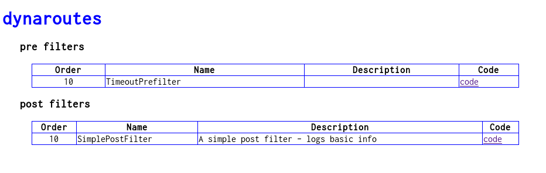
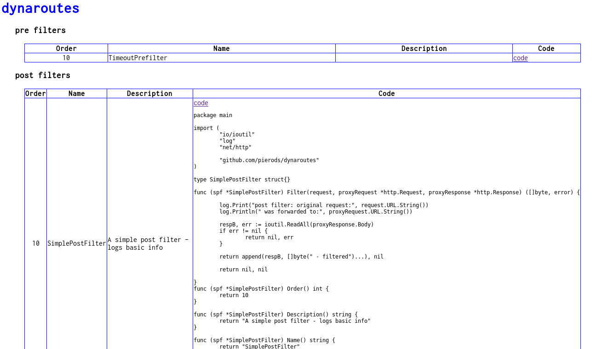

# dynaroutes - a reverse proxy for dynamic routing, with scripted Go

[](https://opensource.org/licenses/Apache-2.0)
[](http://godoc.org/github.com/pierods/dynaroutes)
[](https://goreportcard.com/report/github.com/pierods/dynaroutes)
[](https://travis-ci.org/pierods/dynaroutes)

dynaroutes is a reverse proxy, inspired by [Zuul](https://github.com/Netflix/zuul). It features:

+ dynamic filters - written in Go and compiled on the fly. 
+ directory-based or consul-based filter loading/unloading/editing

## Use cases
dynaroutes is useful for:
+ A/B testing at full speed - only compiled code is used
+ Quick scaffolding of microservice architectures
+ On-the-fly routing changes, hot reload of filters
+ load balancing
+ surgical routing
+ statistics gathering
+ authentication
+ logging, monitoring etc.


## What is a filter

A filter is a small program that is applied either at the moment when a request comes into the reverse proxy ("pre filters") or after 
a proxy request has returned ("post filters") - but before the final response is sent out.
Many pre and post filters can be added to dynaroutes. Every filter has got an order, and they are apllied in that order.

### pre filters

Pre filters have this interface:

```Go
    type PreFilter interface {
        Name() string
        Order() int
        Description() string
        //Filter returns a Route in case it decides to route the request, nil otherwise.
        Filter(request *http.Request) (*Route, error)
    }
```
Pre filters are able to determine where a request will be proxied to. They have the complete, original request to make that decision:

```Go
// Route is returned by pre filters to set the reverse proxy request parameters
    type Route struct {
        Scheme  string
        Host    string
        URI     string
        Port    int
        Method  string
        Timeout time.Duration
}
```
Pre filters are applied (Filter() is called) until a filter returns a route. Then the router stops applying filters and forwards the request 
to the desired endpoint, as described by the returned Route. A Route can set the Scheme/host/URI/Port/Method/Timeout of a request.

### post filters

After the proxy request has returned, post filters are called. A post filter has this interface:

```Go
    //PostFilter is applied before a response is sent back to the client. Many post filter can be defined, and they are applied in the order defined by Order(), however as soon as a non-nil []byte is returned, the router stops applying post filters.
    type PostFilter interface {
        Name() string
        Order() int
        Description() string
        //Filter can return nil, or a []byte, in which case that's what will be sent back to the client
        Filter(request, proxyRequest *http.Request, proxyResponse *http.Response) ([]byte, error)
    }

```
Every post filter has at its disposal the original request, the proxied request (the proxied address can be seen for example) and the proxied 
response.
In case a post filter decides it wants to modify the response returned by the router, it can return a []byte with the desired response. 
The router will stop applying filters and send that response to the client instead.

### where are filters found

dynaroutes can be instantiated in file mode or consul mode.
If you have acces to a directory on the host machine, then do this:
```bash
    dynarouter -port 8080 \
        -interface xxx.xxx.xxx.xxx \
        -readtimeout 10 \
        -writetimeout 10 \
        -filterdir  "/path/to/directory" 
        -consolehost xxx.xxx.xxx.xxx
        -consoleport 30000
```

then write your filters and drop them in that directory. You can then either edit them in place, or re-drop them or delete them and any change
will be picked up by dynaroutes. Filters must have names ending in .go, like "myprefilter.go".

If you prefer to use consul, and consul is running on machine consulhost:consulport, then do this:
```bash
    dynarouter -port 8080 \
        -interface xxx.xxx.xxx.xxx \
        -readtimeout 10 \
        -writetimeout 10 \
        -consul  true
        -consulport consulport
        -consulhost  consulhost
        -consulprefix  "com.github.pierods.dynaroutes.filters"
        -consolehost xxx.xxx.xxx.xxx
        -consoleport 30000
```
dynaroutes will watch the consulprefix key and pick up filters from there. Sub-keys must have names ending in .go, like "myprefilter.go"

### accessing the console
Point your browser to consolehost:consoleport (default localhost:30000):




You can also observe the code of the filters:


### how do filters look

Here is a sample pre filter:
```Go
package main

import (
	"context"
	"net/http"

	"github.com/pierods/dynaroutes"
)

type EchoRoutePreFilter struct{}

func (srf *EchoRoutePreFilter) Filter(request *http.Request) (*dynaroutes.Route, error) {

	newCtx := context.WithValue(request.Context(), "filterkey", "this value will be available to other pre filters and post filters")
	*request = *request.WithContext(newCtx)
	return &dynaroutes.Route{
		Scheme: "http",
		Host:   "localhost",
		URI:    request.URL.String(),
		Port:   50000,
		Method: request.Method,
	}, nil
}
func (srf *EchoRoutePreFilter) Order() int {
	return 100
}

func (srf *EchoRoutePreFilter) Description() string {
	return "A simple route filter - forwards to localhost:50000"
}

func (srf *EchoRoutePreFilter) Name() string {
	return "EchoRoutePreFilter"
}

var PreFilter dynaroutes.PreFilter = &EchoRoutePreFilter{}

func main() {}


```
A pre filter:

+ must be in package main
+ must have an exported var called PreFilter, implementing dynarouter.Prefilter
+ can have a func main() {} stub, to make it compilable on the local machine


Here is a sample post filter:

```Go
package main

import (
	"io/ioutil"
	"log"
	"net/http"

	"github.com/pierods/dynaroutes"
)

type SimplePostFilter struct{}

func (spf *SimplePostFilter) Filter(request, proxyRequest *http.Request, proxyResponse *http.Response) ([]byte, error) {

	log.Print("post filter: original request:", request.URL.String())
	log.Println(" was forwarded to:", proxyRequest.URL.String())
	log.Println(request.Context().Value("filterkey"))
	respB, err := ioutil.ReadAll(proxyResponse.Body)
	if err != nil {
		return nil, err
	}

	return append(respB, []byte(" - filtered")...), nil
}

func (spf *SimplePostFilter) Order() int {
	return 10
}

func (spf *SimplePostFilter) Description() string {
	return "A simple post filter - logs basic info"
}

func (spf *SimplePostFilter) Name() string {
	return "SimplePostFilter"
}

var PostFilter dynaroutes.PostFilter = &SimplePostFilter{}

func main() {}

```

A post filter:

+ must be in package main
+ must have an exported var called PostFilter, implementing dynarouter.Postfilter
+ can have a func main() {} stub, to make it compilable on the local machine


## Installation
Compile and build dynaroutes: get and install [pluginator](github.com/pierods/pluginator)

```bash

    go get github.com/hashicorp/consul/api
    go get github.com/google/uuid
    go get github.com/fsnotify/fsnotify
    go get github.com/pierods/pluginator
    
    cd pluginator
    go install
```

get and install dynaroutes:
```bash
   
    go get github.com/pierods/embedder
    go get github.com/pierods/dynaroutes
    
    cd dynaroutes
    go generate
    cd dynarouter
    go install
   
```
Make sure there is a go tooolchain on the host machine  - basically, untar a go distro and put its bin folder in the PATH. 
Instructions [here](https://golang.org/doc/install?download=go1.8.3.linux-amd64.tar.gz).

## Notes
### why no route filters

In Zuul, there are pre, route and post filters. Problem is, route filters do the actual request proxying themselves. 
See for example [SimpleHostRoutingFilter.groovy](https://github.com/Netflix/zuul/blob/1.x/zuul-simple-webapp/src/main/groovy/filters/route/SimpleHostRoutingFilter.groovy):
```java
    ...
    switch (verb) {
                case 'POST':
                    httpRequest = new HttpPost(uri + getQueryString())
                    InputStreamEntity entity = new InputStreamEntity(requestEntity)
                    httpRequest.setEntity(entity)
                    break
                case 'PUT':
                    httpRequest = new HttpPut(uri + getQueryString())
                    InputStreamEntity entity = new InputStreamEntity(requestEntity, request.getContentLength())
                    httpRequest.setEntity(entity)
                    break;
                default:
                    httpRequest = new BasicHttpRequest(verb, uri + getQueryString())
    }
    ...
```
SimpleHostRoutingFilter.groovy has 435 lines of scripted code - not ideal from a maintenance standpoint. Also, it is not clear to me why every 
route filter should reimplement a router, and what is the advantage of doing so. dynaroutes does the routing after pre filters have run.

One benefit of having route filters is that there can be many of them, and multiple routing can be done. While this can be still done without writing 
multiple reverse proxies (a route filter could simply be handled the response of the last call and return another route or not) it is still debatable
whether a dynamic reverse proxy should also act as an API gateway, and instead route to a special purpose API gateway instead. Should such demand arise,
this functionality could be implemented.

### why no lua/javascript filters
There exist scripting engines for Go with target languages [javascript](https://github.com/robertkrimen/otto) and [lua](https://github.com/Shopify/go-lua). 
However, since Go can be compiled and loaded on the fly, and filters are not full-fledged programs, but bits of functionality, there is no clear
advantage in having filters written in another language. 
There are clear disadvantages though:
+ one must learn and use another language
+ there is a performance loss in using a scripting engine
+ scripting engines occupy memory and take CPU cycles
+ scripting engines tend to fall behind on features of their target language
+ scripting engines lose expressivity when compared to their host language, since the host language APIs must be exposed through a different language

### limitations
dynaroutes only works with Go >= 1.8, on linux. Plugins can be written under any OS though.